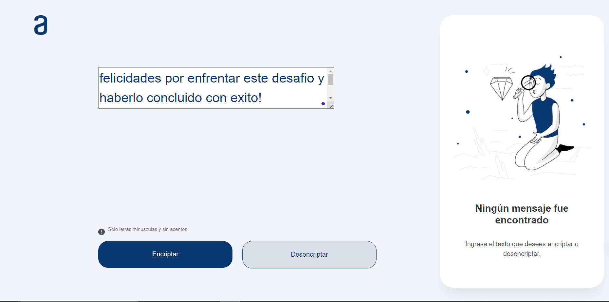

<h1>Encriptador de texto</h1>
<h2>Challenge ONE - Oracle + Alura Latam</h2>
<h2>Primer desafío</h2>
Las "llaves" de encriptación que utilizaremos son las siguientes:

La letra "e" es convertida para "enter"
La letra "i" es convertida para "imes"
La letra "a" es convertida para "ai"
La letra "o" es convertida para "ober"
La letra "u" es convertida para "ufat"
<h3>Requisitos:</h3>
Debe funcionar solo con letras minúsculas
No deben ser utilizados letras con acentos ni caracteres especiales
Debe ser posible convertir una palabra para la versión encriptada también devolver una palabra encriptada para su versión original.
Por ejemplo:

"gato" => "gaitober"

"gaitober" => "gato"

La página debe tener campos para inserción del texto que será encriptado o desencriptado, y el usuario debe poder escoger entre as dos opciones. El resultado debe ser mostrado en la pantalla.

<h3>Extras:</h3>
Un botón que copie el texto encriptado/desencriptado para la sección de transferencia, o sea que tenga la misma funcionalidad del ctrl+C o de la opción "copiar" del menú de las aplicaciones.

Github Pages: https://emmanuel-vandyk.github.io/Encriptador-de-texto-v2/
